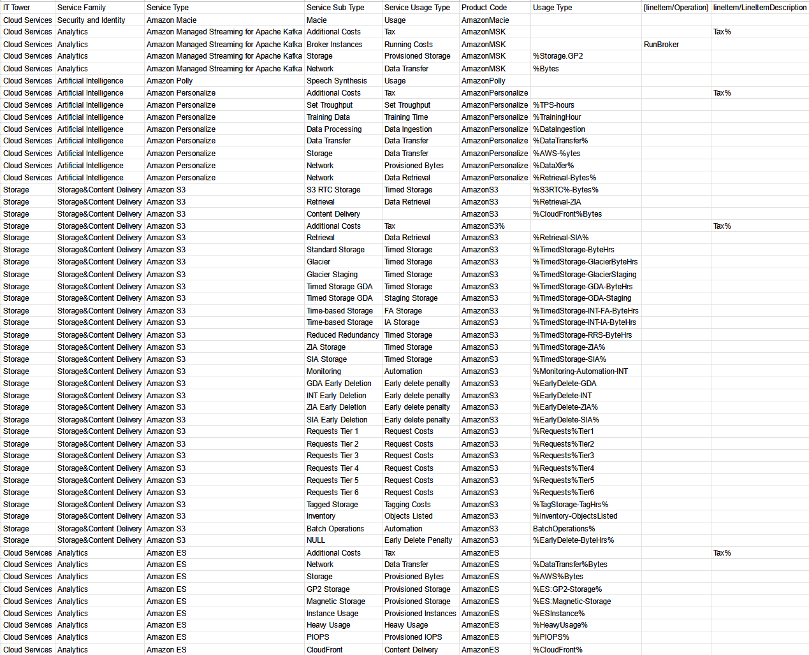

# Лабораторная работа AWS

Знакомство с IaaS, PaaS, SaaS сервисами в облаке на примере Amazon Web Services (AWS). Создание сервисной модели.

---

### Цель работы
Знакомство с облачными сервисами. Понимание уровней абстракции над инфраструктурой в облаке. Формирование понимания типов потребления сервисов в сервисной-модели. 

### Дано 
1. Слепок данных биллинга от провайдера после небольшой обработки в виде SQL-параметров. Символ % в начале/конце означает, что перед/после него может стоять любой набор символов.
2. Образец итогового соответствия, что желательно получить в конце. В этом же документе  

### Необходимо 
1. Импортировать файл .csv в Excel или любую другую программу работы с таблицами. Для Excel делается на вкладке Данные – Из текстового / csv файла – выбрать файл, разделитель – точка с запятой.
2. Распределить потребление сервисов по иерархии, чтобы можно было провести анализ от большего к меньшему (напр. От всех вычислительных ресурсов Compute дойти до конкретного типа использования - Выделенной стойка в датацентре Dedicated host usage).
3. Сохранить файл и залить в соответствующую папку на Google Drive.

### Алгоритм работы
Сопоставить входящие данные от провайдера с его же документацией. Написать в соответствие колонкам справа значения 5 колонок слева, которые бы однозначно классифицировали тип сервиса. Для столбцов IT Tower и Service Family значения можно выбрать из образца.

### Выполнение
Выполенения данной лабораторной работы можно разделить на несколько этапов:
1. Столбцы `IT Tower` и `Service Family` заполняются первыми при помощи документации AWS и данной нам таблицы с типами для этих столбцов.
2. Столбец `Service Type` с названием типа услуги также не вызывает трудностей и копируется из документации AWS
3. Столбцы `Service Sub Type` и `Service Usage Type` были заполнены с использованием информации из открытых источников и материалов лекций

Таблица до заполнения: 

Таблица после заполнения:

В данном варианте лабораторной работы были проанализированы следующие сервисы AWS:

| Service Family |                  Service                  |                                                                Description                                                                 |
|:--------------:|:-----------------------------------------:|:------------------------------------------------------------------------------------------------------------------------------------------:|
|     Security and Identity      |               Amazon Macie                |      Сервис для обеспечения безопасности и конфиденциальности данных. Machine использует машинное обучение и сопоставление шаблонов.       |
|     Analytics      | Amazon Managed Streaming for Apache Kafka |              Сервис, который упрощает создание и запуск приложений, использующих Apache Kafka для обработки потоковых данных.              |
|     Artificial Intelligence      |                     Amazon Polly                      |                         Сервис преобразования текста в речь (TTS), который преобразует текст в реалистичную речь.                          |
|     Storage&Content Delivery      |                     Amazon S3                      |                       Сервис для хранения и извлечения любого объема данных в любое время из любой точки Интернета.                        |
|     Analytics      |                     Amazon Elasticsearch Service                       | Упрощает развертывание, эксплуатацию и масштабирование. Используется для анализа журналов, полнотекстового поиска, мониторинга приложений. |

### Вывод
В ходе данной лабораторной работы я ближе познакомился с облачными сервисами, научился разделять типы потребления сервисов в сервисной модели и разделять их по уровням абстракции над инфраструктурой в облаке.