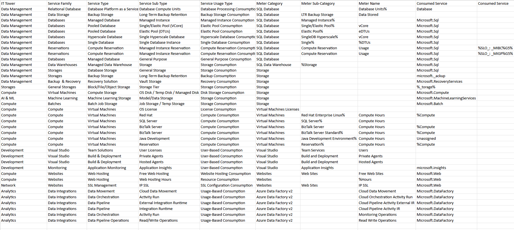

# Лабораторная работа Azure

Сравнение сервисов Amazon Web Services и Microsoft Azure. Создание единой кросс-провайдерной сервисной модели.

---

### Цель работы
Получение навыков аналитики и понимания спектра публичных облачных сервисов без привязки к вендору. Формирование у студентов комплексного видения Облака. 

### Дано 
1. Данные лабораторной работы 1.
2. Слепок данных биллинга от провайдера после небольшой обработки в виде SQL-параметров. Символ % в начале/конце означает, что перед/после него может стоять любой набор символов.
3. Образец итогового соответствия, что желательно получить в конце. В этом же документе

### Необходимо 
1. Импортировать файл .csv в Excel или любую другую программу работы с таблицами. Для Excel делается на вкладке Данные – Из текстового / csv файла – выбрать файл, разделитель – точка с запятой.
2. Распределить потребление сервисов по иерархии, чтобы можно было провести анализ от большего к меньшему (напр. От всех вычислительных ресурсов Compute дойти до конкретного типа использования - Выделенной стойка в датацентре Dedicated host usage). При этом сохранять логическую концепцию, выработанную в Лабораторной работе 1.
3. Сохранить файл и залить в соответствующую папку на Google Drive.

### Алгоритм работы
Сопоставить входящие данные от провайдера с его же документацией. Написать в соответствие колонкам справа значения 5 колонок слева, которые бы однозначно классифицировали тип сервиса. Для столбцов IT Tower и Service Family значения можно выбрать из образца. В ходе выполнения работы не отходить от принципов классификации, выбранных в Лабораторной работе 1. Например, если сервис Машинного обучения был разбит на Вычислительные мощности и Облачные сервисы, то продолжать его разбивать и в новых данных.

### Выполнение
После заполнения всех необходимых полей, таблица имеет следующий вид:

В данном варианте лабораторной работы были следующие сервисы AWS:

| **Service Family**                       | **Family**                      | **Description**                                                                                                                                      |
|------------------------------------------|---------------------------------|------------------------------------------------------------------------------------------------------------------------------------------------------|
| **Web Application Firewall**             | Network Security                | Облачный фаервол, обеспечивающий защиту веб-приложений от атак.                                                                                      |
| **Static Web Apps**                      | Web Services                    | Сервис для развертывания статичных веб-приложений, предлагающий бесплатный тариф.                                                                    |
| **Azure Data Factory**                   | Data Integration                | Сервис для интеграции данных из разных источников в облаке, с возможностями оркестрации, мониторинга, перемещения данных и создания пайплайнов.    |
| **Virtual Machines**                     | Compute                         | Сервис для создания и развертывания виртуальных машин с выбором операционных систем, платформ, предустановленных серверов и средств разработки. Также поддерживается резервирование ресурсов. |
| **Enterprise Licenses**                  | Licensing                       | Сервис для предоставления корпоративных лицензий на различное программное обеспечение.                                                            |
| **Azure Backup**                         | Backup & Disaster Recovery      | Сервис для регулярного создания резервных копий и восстановления данных.                                                                            |
| **SQL Server on Azure Virtual Machines** | Compute & Databases           | Сервис для размещения SQL Server на виртуальных машинах в облаке, который поддерживает миграцию в инфраструктуру как услугу (IaaS).                 |
| **Azure Machine Learning**               | AI & Machine Learning           | Сервис для разработки, обучения и развертывания моделей машинного обучения, с инструментами для подготовки данных и мониторинга моделей.            |
| **Batch**                                | Compute                         | Облачный сервис для выполнения пакетных вычислений, который управляет распределением нагрузки между виртуальными машинами.                         |
| **Table Storage**                        | Storage                         | NoSQL хранилище с высокой доступностью и возможностью масштабирования.                                                                               |
| **Azure SQL**                            | Databases                       | Сервис для разработки, управления и масштабирования баз данных, а также для анализа данных. Поддерживает перенос локальных баз данных в облако.    |
| **Azure SQL Database**                   | Databases                       | Облачный сервис для работы с реляционными базами данных, обеспечивающий высокую производительность и надежную доступность.                          |
| **Azure Storage Actions**                | Storage                         | Сервис, который позволяет выполнять операции с данными в хранилище: чтение, запись, копирование и удаление.                                         |
| **Visual Studio**                        | Developer Tools                 | Сервис для разработки приложений в облаке, с поддержкой подписок, мониторинга и автоматизации сборки и развертывания.                               |

### Вывод
Данная лабораторная работа позволила мне лучше понять отличия Amazon Web Services и Microsoft Azure, закрепить знания уровней абстракции над инфраструктурой в облаке и типов потребления.
    