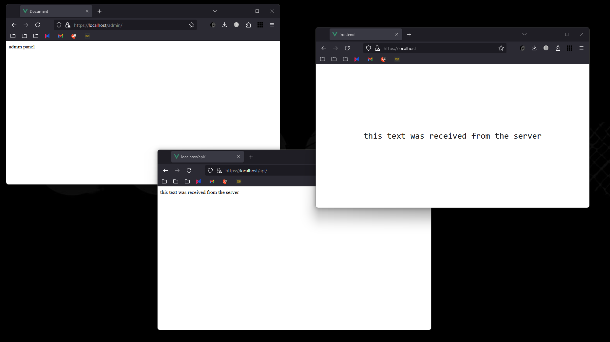
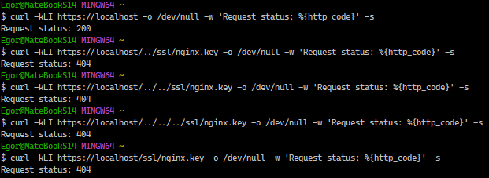
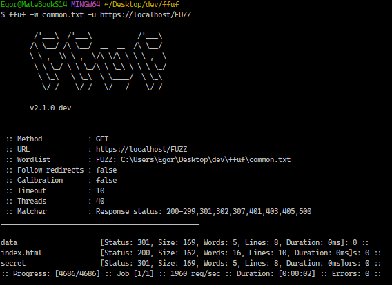
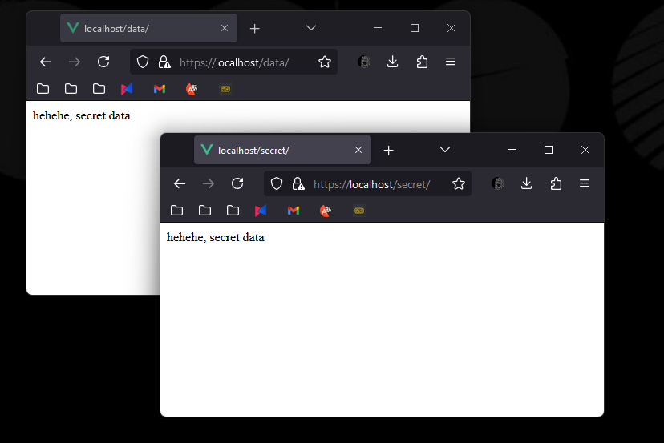
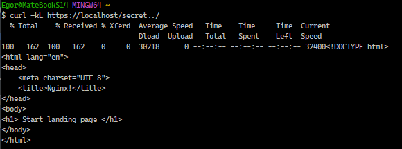

# Лабораторная работа №1 
Лабораторная работа №1 посвящена настройке nginx по заданному тз.

## Техническое задание
1. Должен работать по https c сертификатом
2. Настроить принудительное перенаправление HTTP-запросов (порт 80) на HTTPS (порт 443) для обеспечения безопасного соединения.
3. Использовать alias для создания псевдонимов путей к файлам или каталогам на сервере.
4. Настроить виртуальные хосты для обслуживания нескольких доменных имен на одном сервере.
5. Что угодно еще под требования проекта

## Начало работы
В качестве примера я создам два приложения (клиент-сервер), а также для удобства буду ипользовать docker compose

## Создание сервера
Первым приложением будет простой сервер на express.js, единственная задача которого отдавать небольшой текст.
```javascript
const express = require('express')
const app = express()
const port = 8000
const host = '0.0.0.0'

app.get('/', (req, res) => {
  res.send('this text was received from the server')
})

app.listen(port, host, () => {
  console.log(`Example app listening on port ${port}`)
})

```

### Dockerfile
Для удобства пользования я заверну данный сервер в контейнер
```dockerfile
FROM node:20-slim AS build

WORKDIR /app

COPY package*.json ./

RUN npm ci

COPY . .

CMD ["node", "server.js"]
```

## Создание клиента
Клиентом, который будет получать данные от сервера, у нас будет обычное vue.js приложение. Главная страница будет отправлять GET-запрос на путь /api и выводить результат.

Ниже приведён отрывок кода, который получает строку с сервера
```javascript
fetch('https://localhost/api', {
      method: 'GET'
}).then(resp => resp.text())
  .then(data => this.message = data)
```

### Dockerfile
```dockerfile
FROM node:20-slim AS build

WORKDIR /app

COPY package*.json ./

RUN npm ci

COPY . .

RUN npm run build

FROM nginx:stable-alpine

COPY --from=build /app/dist /usr/share/nginx/html
COPY --from=build /app/nginx.conf /etc/nginx/conf.d/default.conf

EXPOSE 80

CMD ["nginx", "-g", "daemon off;"]
```

### nginx
```nginx configuration
server {
    listen 3000;

    location / {
        root /usr/share/nginx/html;
        index index.html;
    }

    include /etc/nginx/extra-conf.d/*.conf;
}
```

## Настройка nginx

### Конфигурационный файл

`daemon off` Отключает режим работы демона

upstream: Определяет два пула серверов для обработки запросов:
- backend слушает на порту 8000 (сервер для API). 
- frontend слушает на порту 3000 (сервер для фронтенда).

Первая конструкция server настраивает принудительное перенаправление запросов с 80 порта на 443 порт (HTTPS)

Вторая  слушает на порту 443 (HTTPS) с поддержкой SSL.

`ssl_certificate /ssl/nginx.crt` и `ssl_certificate_key /ssl/nginx.key`: Указывают путь к SSL-сертификату и ключу.

`location /`: Проксирует запросы к корневому URL на фронтенд сервер (порт 3000).

`location /api/`: Проксирует запросы с префиксом /api/ на бэкенд сервер (порт 8000).

`location /admin/`: Обслуживает статические файлы из директории /etc/nginx/html/data/ для запросов к /admin/.

```nginx configuration
events {}

daemon off;

http {

    upstream backend {
        server backend:8000;
    }

    upstream frontend {
        server frontend:3000;
    }

    server {
        listen 80;
        server_name localhost;
        return 301 https://$host$request_uri;
    }

    server {
        listen 443 ssl;

        ssl_certificate /etc/nginx/ssl/nginx.crt;
        ssl_certificate_key /etc/nginx/ssl/nginx.key;

        location / {
            proxy_pass http://frontend/;
        }

        location /api/ {
            proxy_pass http://backend/;
        }

        location /admin/ {
            alias /etc/nginx/html/data/;
        }

    }
}
```


### SSL-сертификаты

Самоподписанные сертификаты были созданы при помощи openssl.
```shell
openssl req -x509 -nodes -days 365 -newkey rsa:2048 -keyout ssl/nginx.key -out ssl/nginx.crt
```

### Dockerfile
Копируем необходимые для работы файлы и запускаем nginx
```dockerfile
FROM nginx:stable-alpine

COPY html /etc/nginx/html

COPY nginx.conf /etc/nginx/nginx.conf
COPY ssl/nginx.crt /etc/nginx/ssl/nginx.crt
COPY ssl/nginx.key /etc/nginx/ssl/nginx.key

CMD ["nginx"]
```

## Docker compose
Также настроем docker-compose файл, чтобы запустить и объединить все наши сервисы
```yaml
version: '3'

services:
  backend:
    build:
      context: backend
      dockerfile: Dockerfile
    container_name: backend

  frontend:
    build:
      context: frontend
      dockerfile: Dockerfile
    container_name: frontend

  nginx:
    build:
      context: nginx
      dockerfile: Dockerfile
    container_name: nginx
    ports:
      - "80:80"
      - "443:443"
    depends_on:
      - backend
      - frontend
```

## Результат
Итогом данной лабораторной работы стал настроенный nginx сервер, на котором были запущены клиент и сервер.


# Задание со звёздочкой*
Для поиска уязвимостей я выбрал nginx из данного [репозитория](https://github.com/Sandrolek/ITMO-devops-labs).

## Path Traversal
Попытался достать `nginx.key` при помощи path traversal, однако переместиться к нему у меня так и не удалось.



## FFUF 
После перебора путей при помощи конольной утилиты fuff, были найдены следующие пути:




Перебор поддоменов не дал никаких результатов


## Alias Traversal
Заметил, что в `nginx.conf` путь не закрыт слешем, а значит имеет место быть Alias Traversal

```nginx configuration
location /secret {
    alias /etc/nginx/html/data/;
}
```

Следующий запрос отлично показывает, что после /secret можно написать что-угодно и nginx попытается найти подходящий путь.



## Вывод
Протестировав данную сборку, была обнаружена 1 потенциальная уязвимость и спрятанная страница.
