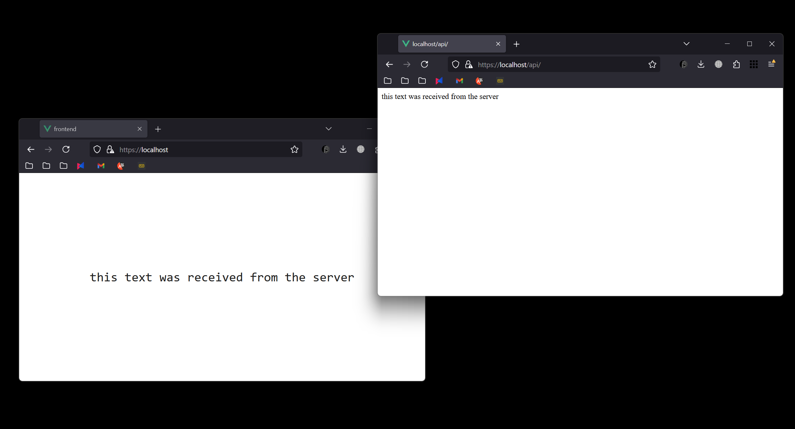

# Лабораторная работа №1 - Настройка nginx

## Техническое задание
1. Должен работать по https c сертификатом
2. Настроить принудительное перенаправление HTTP-запросов (порт 80) на HTTPS (порт 443) для обеспечения безопасного соединения.
3. Использовать alias для создания псевдонимов путей к файлам или каталогам на сервере.
4. Настроить виртуальные хосты для обслуживания нескольких доменных имен на одном сервере.

## Предисловие
Сервер будет поддерживать 2 виртуальных хоста. Первый предназначен для frontend части приложения (на vue.js), второй для backend (express.js). Оба приложения будут настроены и запущены в контейнерах для облегчения запуска.

## 1. Сервер - Express.js
Сервер будет просто отдавать небольшой текст на клиентскую часть 
```js
const express = require('express')
const app = express()
const port = 8000
const host = '0.0.0.0'

app.get('/', (req, res) => {
  res.send('this text was received from the server')
})

app.listen(port, host, () => {
  console.log(`Example app listening on port ${port}`)
})
```
### Dockerfile
Dockerfile для этого приложения тоже будет довольно простым. В качестве образа возьмём `node:slim` так как нам не нужен полный функционал node.js. В остальном самый обычный Dockerfile. Подтягиваем зависимости из `package.json` и запускаем сервер при помощи `node server.js`.
```Dockerfile
FROM node:slim

WORKDIR /app

COPY . .
RUN npm install

CMD ["node", "server.js"]
```

## 2. Клиент - Vue.js
Для клиента использвуется легковесный фреймворк vue.js c всего 1 главной страницой `App.vue`. Там же добавим несколько строчек для получения данных от нашего сервера 
```js
    fetch('https://localhost/api', {
      method: 'GET'
    })
      .then(resp => resp.text())
      .then(data => {
        let text = data.split('')
        const typing = setInterval(() => {
          this.message += text.shift()
          if (text.length === 0) clearInterval(typing);
        }, 50)
      })
```
### Dockerfile
```Dockerfile
FROM node:alpine as build

COPY package.json package.json
RUN npm install 

COPY . .
RUN npm run build

FROM nginx:stable-alpine
COPY --from=build /dist /usr/share/nginx/html
COPY --from=build nginx.conf /etc/nginx/conf.d/default.conf

EXPOSE 3000

CMD ["nginx", "-g", "daemon off;"]
```

### Nginx
```nginx configuration
server {
    listen 3000;

    location / {
        root /usr/share/nginx/html;
        index index.html;
    }

    include /etc/nginx/extra-conf.d/*.conf;
}

```

## 3. Nginx Configuration

```shell
openssl req -x509 -nodes -days 365 -newkey rsa:2048 -keyout nginx.key -out nginx.crt
```

### nginx.conf
```nginx configuration
events {}

daemon off;

http {

    upstream backend {
        server backend:8000;
    }

    upstream frontend {
        server frontend:3000;
    }

    server {
        listen 80;
        server_name localhost;
        return 301 https://$host$request_uri;
    }

    server {
        listen 443 ssl;

        ssl_certificate /etc/nginx/ssl/nginx.crt;
        ssl_certificate_key /etc/nginx/ssl/nginx.key;

        location / {
            proxy_pass http://frontend/;
        }

        location /api/ {
            proxy_pass http://backend/;
        }
    }
}
```

### Dockerfile
```Dockerfile
FROM nginx:stable-alpine

COPY nginx.conf /etc/nginx/nginx.conf
COPY ssl/nginx.crt /etc/nginx/ssl/nginx.crt
COPY ssl/nginx.key /etc/nginx/ssl/nginx.key

CMD ["nginx"]
```

### Docker compose file
```yml
version: '3'

services:
  backend:
    build:
      context: backend
      dockerfile: Dockerfile
    container_name: backend

  frontend:
    build:
      context: frontend
      dockerfile: Dockerfile
    container_name: frontend

  nginx:
    build:
      context: nginx
      dockerfile: Dockerfile
    container_name: nginx
    ports:
      - "80:80"
      - "443:443"
    depends_on:
      - backend
      - frontend
```

## 4. Результаты
По итогам работы у нас есть два полностью рабочих приложения на 1 домене, которые могут общаться друг с другом и пересылать данные

