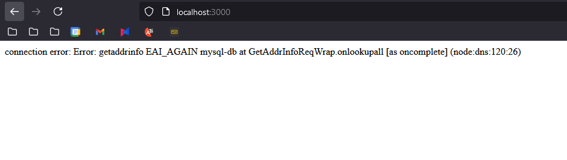

# Лабораторная работа №2

## Dockerfile

### 1. Bad practice

```dockerfile
FROM node:latest

USER root

WORKDIR /app

COPY . .

RUN npm i

CMD ["node", "server.js"]
```
1. Использование node:latest (это не фиксированная версия, и она может измениться в будущем, что приведет к неожиданным проблемам совместимости или нестабильности)
2. Запуск от имени root (любая уязвимость в приложении может дать доступ к root-правам в контейнере)
3. Использование npm install вместо npm ci (может привести к установке зависимостей, которые отличаются от зафиксированных в package-lock.json, что снижает предсказуемость сборки)
4. Не указывается какой порт будет ипользовать контейнер

### 2. Best practice
```dockerfile
FROM node:22-slim

RUN useradd -m appuser

WORKDIR /app

COPY package*.json ./

RUN npm install && npm cache clean --force

COPY . .

USER appuser

EXPOSE 3000

CMD ["node", "server.js"]
```
1. Указывается конкретная версия Node.js  `node:22-slim`
2. Создание непривилегированного пользователя
3. Эффективное кэширование при установке зависимостей
4. Очистка кеша npm
5. Использование конкретного порта
6. Использование npm ci вместо npm install

## Containers

### 1. Не ограничивать ресурсы контейнера
Без ограничения ресурсов контейнер может забрать все доступные ресурсы хоста, 
что урежет производительность других запущенных на данном хосте контейнеров
```shell
docker run --memory="256m" --cpus="0.5" app
```

### 2. Запускать контейнер с root-правами
Запуск контейнеров от пользователя root — это серьёзная уязвимость безопасности, поэтому 
желательно всегда запускать контейнер с минимальными провами, которые нужны для работы.
```shell
docker run --user 1001 app
```

## Docker compose*

Плохой Docker Compose файл (Bad Practices)
```yaml
version: '3'
services:
  web:
    image: 'node:latest'
    ports:
      - '3000:3000'
    volumes:
      - ./web:/usr/share/nginx/html
    environment:
      - NGINX_LOG_LEVEL=debug
    depends_on:
      - db
    networks:
      - default

  db:
    image: 'mysql:latest'
    environment:
      MYSQL_ROOT_PASSWORD: root
    volumes:
      - /data/db:/var/lib/mysql
    ports:
      - '3306:3306'
    networks:
      - default
```

Плохие практики в этом файле:
1. **Использование latest тега**: Использование тега latest для образов может привести к неожиданным обновлениям и неконтролируемым изменениям.
2. **Хранение данных на хосте**: Прямое привязывание данных базы данных к файловой системе хоста несет риски безопасности и потери данных при миграции.
3. **Переменные окружение прямо в файле**: прописанные пароли и конфиденциальные данные  `MYSQL_ROOT_PASSWORD: root` могут быть случайно опубликованы в публичных репозиториях 

Хороший Docker Compose файл (Best Practices)

```yaml
version: '3'

services:
  node-app:
    build:
      context: server
      dockerfile: Dockerfile
    container_name: node-app
    ports:
      - '3000:3000'
    environment:
      MYSQL_HOST: mysql-db
      MYSQL_USER: ${MYSQL_USER}
      MYSQL_PASSWORD: ${MYSQL_PASSWORD}
      MYSQL_DATABASE: ${MYSQL_DATABASE}
    depends_on:
      mysql-db:
        condition: service_healthy
    networks:
      - node-network

  mysql-db:
    image: mysql:8.0
    container_name: mysql-db
    environment:
      MYSQL_ROOT_PASSWORD: ${MYSQL_ROOT_PASSWORD}
      MYSQL_DATABASE: ${MYSQL_DATABASE}
      MYSQL_USER: ${MYSQL_USER}
      MYSQL_PASSWORD: ${MYSQL_PASSWORD}
    volumes:
      - db-data:/var/lib/mysql
    ports:
      - '3306:3306'
    healthcheck:
      test: ["CMD", "mysqladmin", "ping", "-h", "localhost"]
      interval: 10s
      timeout: 5s
      retries: 5
    networks:
      - db-network

volumes:
  db-data:

networks:
  db-network:
    driver: bridge
  node-network:
    driver: bridge

```
Исправленные плохие практики:
1. **Фиксированные версии образов**: Указаны конкретные версии образов, что исключает неожиданное поведение контейнеров при обновлениях.
2. **Использование именованного volume**: Данные базы данных теперь хранятся в именованном volume, что улучшает управление данными и их изоляцию от хоста.
3. **Изоляция сетей**: Веб-сервис и база данных разделены на две разные сети, что предотвращает ненужные связи и улучшает безопасность. В данном примере они не видят друг друга
4. **Переменные окружения**: Все были конфиденциальные данные вынесены в .env 
5. **Healthcheck**: Проверяет состояние базы данных 

---

Созданы две отдельные сети: node-network для веб-сервиса и db-network для базы данных.
Сервисы размещены в разных сетях что позволяет поднять контейнеры вместе, но исключить доступ по сети.

Контейнеры, находящиеся в разных сетях, не могут взаимодействовать друг с другом напрямую по сети. Это повышает безопасность и позволяет гибко управлять доступом между сервисами. В Docker Compose можно явно указать, к каким сетям подключать каждый контейнер, что исключает лишние связи.
Этот подход помогает обеспечить как безопасность, так и более гибкую настройку сервисов.

